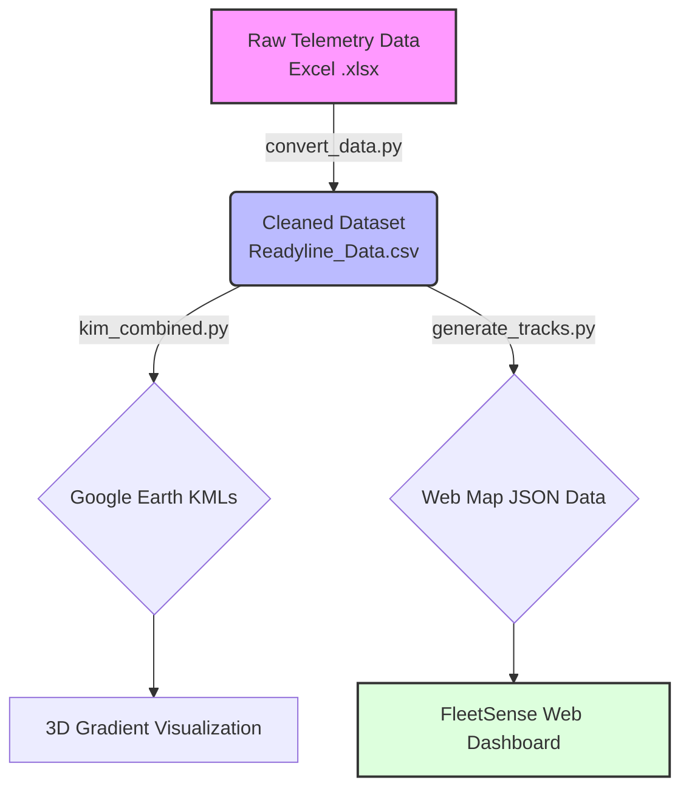

<div align="center">
  
  <h1>FleetSense: AI Dumper Dashboard & HRG Analysis</h1>
  <p><strong>Advanced Telemetry & Haul Road Gradient Analytics Platform</strong></p>
  
  [](https://ayushsahoo19.github.io/AI_Dumper_Dashboard/)
  [](https://www.python.org/)
  [](#)
</div>

---

## ⚡ Overview

**FleetSense** (formerly AI Dumper Dashboard) is a high-performance analytics ecosystem designed for the mining industry. It processes raw dumper telemetry data (GPS coordinates and elevation) to calculate **Haul Road Gradients (HRG)** and visualize fleet movements in real-time. 

By identifying inefficient, steep, or dangerous road segments, FleetSense enables mine operators to optimize haulage routes, reduce fuel consumption, and improve safety.

### ✨ Key Features
- **🌍 Gradient Mapping:** Automatically color-codes haul road segments (🟢 < 6.25%, 🟡 6.25 - 10%, 🔴 > 10%) and exports to Google Earth (KML).
- **📊 Premium Web Dashboard:** A sleek, light-mode interface displaying critical fleet KPIs (Payload, Fuel, Trips).
- **🗺️ Interactive Web Maps:** Seamless Leaflet integration for viewing raw GPS telemetry paths directly in the browser.
- **⚙️ Automated ETL Pipeline:** Python-powered scripts to ingest Excel files and emit dashboard-ready JSON and KMLs.

---

## 🏗️ System Architecture

The pipeline consists of a Python-based backend that processes the data, and a static web dashboard hosted on GitHub pages that renders the analytics.



---

## 📂 Repository Structure

```text
├── Documentation/
│   └── prompt.md             # Core runbook for AI agents & developers
├── Fleet Dashboard/          # Frontend Web Application
│   ├── index.html            # Main dashboard UI
│   └── assets/               # CSS, JS, and Boxicons
├── Output/                   # Generated KML files for 3D visualization
├── convert_data.py           # Pre-processing script (Excel to CSV)
├── kim_combined.py           # Core ETL script for gradient calculation (CSV to KML)
├── generate_tracks.py        # Web data generator (CSV to JS)
└── index.html                # Root redirect to Fleet Dashboard
```

---

## 🚀 Quick Start Guide

### 1. Requirements
Ensure you have Python installed with the necessary data processing libraries:
```bash
pip install pandas simplekml pyproj
```

### 2. Processing New Telemetry Data
Follow these steps to update the dashboard with new data:

1. **Ingest:** Drop your raw Excel file (e.g., `New_Readyline_Data.xlsx`) into the root directory.
2. **Clean:** Convert it to the unified CSV format:
   ```bash
   python convert_data.py --input "New_Readyline_Data.xlsx" --output "Readyline_Data.csv"
   ```
3. **Generate KMLs:** Build the 3D colored gradient models for Google Earth:
   ```bash
   python kim_combined.py --input "Readyline_Data.csv"
   ```
4. **Update Dashboard:** Inject the new telemetry paths into the frontend:
   ```bash
   python generate_tracks.py
   ```

### 3. Deployment
The dashboard is a static SPA. Push your changes to the `main` branch, and **GitHub Pages** will automatically deploy the latest visualization to:
🔗 [Live Dashboard](https://ayushsahoo19.github.io/AI_Dumper_Dashboard/)

---

## 🎨 Design Philosophy

The web frontend was strictly designed adhering to premium enterprise standards:
* **Frest / Sneat Aesthetic:** Soft diffused shadows, rounded corners (12px), and a clean `#f8f9fa` layout.
* **Typography:** Modern `Inter` font for extreme readability.
* **Iconography:** Integrated **Boxicons** for sharp, scalable, and professional UI indicators.

---
<div align="center">
  <i>Developed for optimized heavy haulage and intelligent fleet command.</i>
</div>
